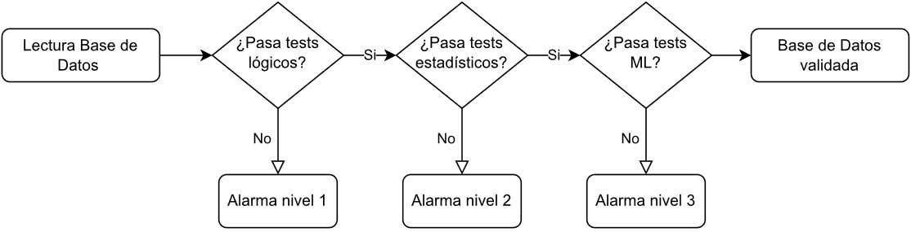

# Capstone - Validación de Datos ITAU
## README de Main y Alarmas

Este archivo contiene informacion de el funcionamiento de main y las funciones alarma que se tienen implementadas

## Librerías utilizadas e instalación

- Numpy ([Instalación](https://numpy.org/install/))
- Pandas ([Instalación](https://pandas.pydata.org/docs/getting_started/install.html))
- re (viene instalada)
- Scipy ([Instalación](https://scipy.org/install/))

## Main
Este es el archivo principal que hay que correr. Su objetivo es definir todos los parametros (especificados en cada README) y llamar a cada funcion de tests distintos junto a las funciones de alarma que se especificaran a continuacion. Se adjunta tambien una imagen para mostrar el flujo

## Funciones
- `Alarma_1(resultados_logicos)`
Aqui solo se encuentra la funcion `alarma_1`, la cual recibe los resultados de `test_logico`. Despues revisa si hay algun test que no haya cumplida (no haya pasado) y si es asi devuelve un False. Si todos los tests se cumplieron se devuelve un True.
- `Alarma_2(resultado_dist,resultado_series,threshold)`
Aqui solo se encuentra la funcion `alarma_2`, la cual recibe los resultados de `test_distribuciones`, `test_series` y `UMBRAL_ALARMA_2`. El  `UMBRAL_ALARMA_2` es la razon de tests que deben pasarse para que se devuelva un True. El procedimiento que se realiza es revisar todos los tests estadisticos hechos y dividen los pasados por el total. Si este numero supera el `UMBRAL_ALARMA_2` se devuelve un True y si no un False.
- `Alarma_3(resultado,threshold)`
Aqui solo se encuentra la funcion `alarma_3`, la cual recibe los resultados de `test_isolation` y `UMBRAL_ALARMA_3`. El  `UMBRAL_ALARMA_3` es la maxima tasa de creciemiento que se puede aceptar en los outliers. La idea es tomar la probabilidad de ser outlier que devuelve isolation forest para cada fila, definir distintos umbrales y calcular cuantas filas tienen una probabilidad mayor a ese umbral. Dado eso se encuentra el punto donde la proporcion de outliers es lo mas cercana a la proporcion de outliers que devuelve isolation forest y se calcula la tasa de creciemiento de outliers en ese punto(derivada). Si esta tasa es mayor que  `UMBRAL_ALARMA_3` se devuelve False y si no lo es se devuelve True